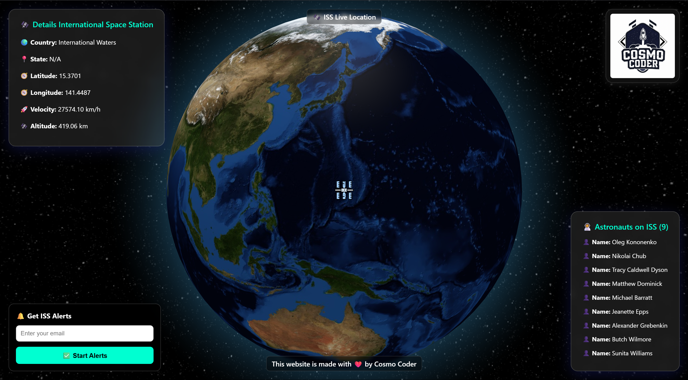
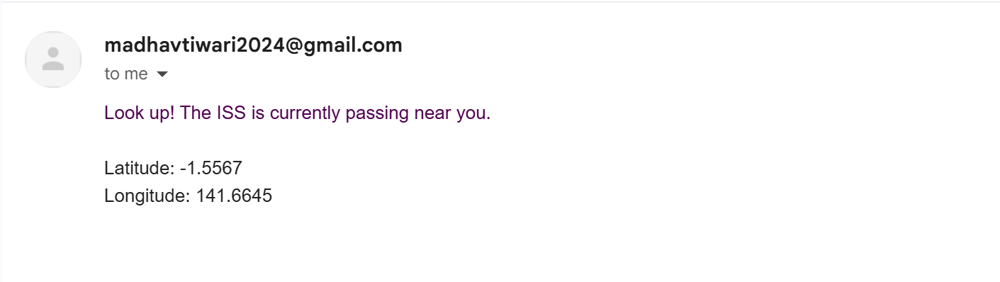

## 🛰️ ISS Live Tracker 🌍

**Track the real-time location of the International Space Station (ISS)** on a 3D globe, view the **astronauts currently aboard**, and receive **Email Alerts** when it's passing near your location!


 

---

### 🚀 Features

* 🌐 Real-time tracking of the ISS on a 3D globe using `react-globe.gl`
* 🛰️ Animated ISS icon with smooth camera follow
* 📍 Displays country, state, coordinates, altitude, and velocity
* ✉️ Sends **email alerts** when ISS is flying over your location
* 🌎 Uses **OpenCage Geocoding API** and **Gmail SMTP** for alerts

---

### 📦 Technologies Used

* **Frontend**: React, react-globe.gl, Three.js, Axios
* **Backend**: Node.js, Express, Axios, Nodemailer
* **APIs**:

  * [Open Notify ISS Location API](http://open-notify.org/Open-Notify-API/ISS-Location-Now/)
  * [OpenCage Geocoder](https://opencagedata.com/)
  * [Gmail SMTP](https://support.google.com/accounts/answer/185833?hl=en)

---

### 🛠️ Setup Instructions

#### 🔹 1. Clone the Repository

```bash
git clone https://github.com/ermadhav/iss-tracker.git
cd iss-tracker
```

#### 🔹 2. Install Frontend & Backend Dependencies

```bash
# Frontend
npm install

# In another terminal for backend
cd backend
npm install
```

#### 🔹 3. Set Up OpenCage API Key

* Get a free key from: [https://opencagedata.com/api](https://opencagedata.com/api)
* Add it in `App.js`:

```js
const OPENCAGE_API_KEY = 'your-key-here';
```

#### 🔹 4. Configure Gmail for Email Alerts

1. Go to your [Google Account > Security](https://myaccount.google.com/security)
2. Enable **2-step verification**
3. Create an **App Password** for Gmail
4. Add credentials in `server.js`:

```js
const transporter = nodemailer.createTransport({
  service: 'gmail',
  auth: {
    user: 'yourgmail@gmail.com',
    pass: 'your_app_password'
  }
});
```

#### 🔹 5. Run the App

```bash
# Start backend
node server.js

# Start frontend (in another terminal)
npm start
```

---

### ✨ How It Works

1. App tracks ISS using Open Notify API every 10 seconds.
2. Uses your browser’s GPS to get your current location.
3. If the ISS is within 1000 km and alerts are enabled, you'll get an email alert.
4. ISS icon updates in real-time on a 3D globe with camera auto-follow.

---

## 📷 Screenshots

### ISS Tracker Interface




---

### ✅ To-Do / Future Features

* [ ] Add "Stop Alerts" button
* [ ] Store email and alert settings in `localStorage`
* [ ] Push/browser notifications
* [ ] Night/day globe theme toggle

---

### 📄 License

MIT License – use it freely, just credit the original author 🙌

---

### 👨‍💻 Author

**Madhav Tiwari**
GitHub: [@ermadhav](https://github.com/ermadhav)
