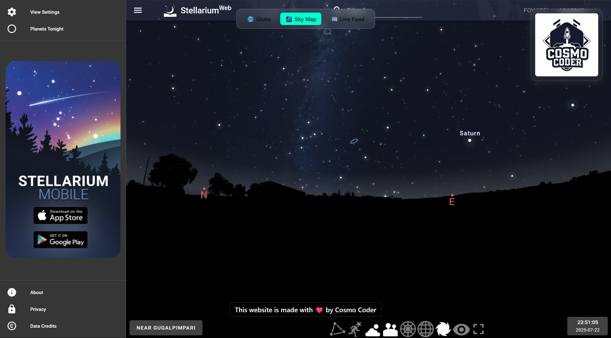
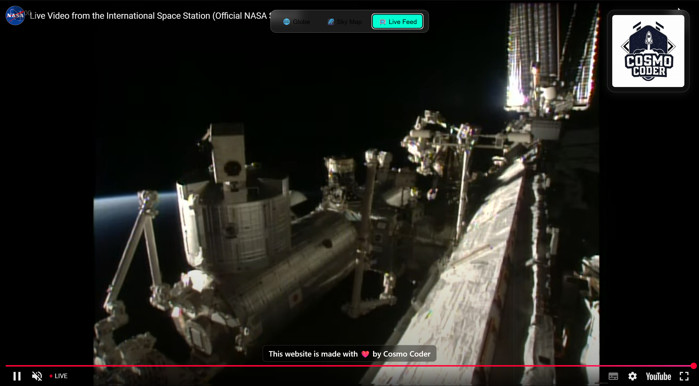

## 🛰️ ISS Live Tracker 🌍

**Track the real-time location of the International Space Station (ISS)** on a 3D globe, view the **astronauts currently aboard**, and receive **Email Alerts** when it's passing near your location!
<br>
<br>


---

### 🚀 Features

- 🌐 Real-time tracking of the ISS on a 3D globe using `react-globe.gl`
- 🛰️ Animated ISS icon with smooth camera follow
- 📍 Displays country, state, coordinates, altitude, and velocity
- 🧑‍🚀 Shows the **current astronauts aboard the ISS**, including their names and roles
- ✉️ Sends **email alerts** when ISS is flying over your location
- 🎥 Embeds NASA’s live video stream from the ISS window directly in the app
- 🌎 Uses **OpenCage Geocoding API** and **Gmail SMTP** for alerts
- 🔭 Integrated Stellarium Live SkyView for a real-time interactive stargazing experience alongside the ISS tracking
- 🌎 Built for an immersive space experience combining data, visuals, and alerts
---

### 📦 Technologies Used

- **Frontend**: React, react-globe.gl, Three.js, Axios
- **Backend**: Node.js, Express, Axios, Nodemailer
- **APIs**:

  - [Open Notify ISS Location API](http://open-notify.org/Open-Notify-API/ISS-Location-Now/)
  - [OpenCage Geocoder](https://opencagedata.com/)
  - [Gmail SMTP](https://support.google.com/accounts/answer/185833?hl=en)
  - [Gmail SMTP](https://stellarium-web.org/)

---

### 🛠️ Setup Instructions

#### 🔹 1. Clone the Repository

```bash
git clone https://github.com/ermadhav/iss-tracker.git
cd iss-tracker
```

#### 🔹 2. Install Frontend & Backend Dependencies

```bash
# Frontend
npm install

# In another terminal for backend
cd backend
npm install
```

#### 🔹 3. Set Up OpenCage API Key

- Get a free key from: [https://opencagedata.com/api](https://opencagedata.com/api)
- Add it in `App.js`:

```js
const OPENCAGE_API_KEY = "your-key-here";
```

#### 🔹 4. Configure Gmail for Email Alerts

1. Go to your [Google Account > Security](https://myaccount.google.com/security)
2. Enable **2-step verification**
3. Create an **App Password** for Gmail
4. Add credentials in `server.js`:

```js
const transporter = nodemailer.createTransport({
  service: "gmail",
  auth: {
    user: "yourgmail@gmail.com",
    pass: "your_app_password",
  },
});
```

#### 🔹 5. Run the App

```bash
# Start backend
node server.js

# Start frontend (in another terminal)
npm start
```
---

## 📷 Screenshots

### 🛰️ISS Tracker Interface


### 🌃Sky View



### 📺YT Live Feed



### 📧Email Alert


---

### 📄 License

MIT License – use it freely, just credit the me 🙌

---

### 👨‍💻 Author

**Madhav Tiwari**
GitHub: [@ermadhav](https://github.com/ermadhav)
